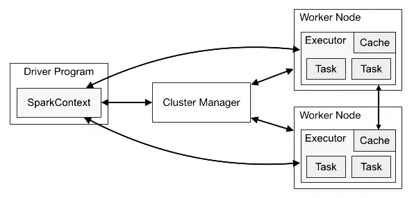

# o que é o spark?

é uma tecnologia voltada para o bigdata, ou seja capaz de analisar um grande volume de dados.

- spark é distruibuido em maquinas (clusters)
- seus dados são armazenadas em memoria ram ( o que o torna mais rapido)
- pode ser processado em real time (straming) em lotes (batchs), sql e até machine learning
- suporta diversas linguagens (sql, python, skala, java)
- tem integração com diversos bancos de dados e plataforma


engine em memoria > busca o dado e salva em memoria

- partições: 

# Arquitetura Spark




-  Driver Program: este é o entry point do Spark. É onde o Spark Context é criado e é onde se define o fluxo de execução, bem como o RDD e o que deve ser executado em paralelo pelos Executores.

- Spark Context: Estabelece configurações de memória e processamento dos Workers Nodes(maquinas). Além disso é capaz de conectar com os diferentes tipos de Cluster Manager (além do próprio Spark Cluster Manager) como Apache Mesos ou Yarn do Hadoop. 


## RDD (resilient distributed dataset)

RDD é a api que interage com as partições e processar(transformações):

**resilient** - caso exista algum erro/falha na comunicação dos drives e nodes, ele vai recalcular para gente sem perder o processo
**distributed** - distribuido em partições e memoria
**dataset** - conjunto não tipado de dados


# Interfaces do Spark

- RDD: API de "nível baixo" do Spark. RDDs são a abstração fundamental do Spark, representando uma coleção distribuída de objetos imutáveis. Eles são resilientes a falhas e podem ser processados em paralelo. RDDs são mais flexíveis, mas podem ser mais complexos de usar em comparação com DataFrames e Datasets.

- DataFrames : Semelhante aos DataFrames do pandas, mas distribuído e otimizado para grandes volumes de dados. DataFrames são coleções distribuídas de dados organizadas em colunas nomeadas. Eles são mais fáceis de usar e oferecem otimizações automáticas. Disponível em Java, Python, R e Scala.

- DataSets : Combinação de DataFrames e RDDs. Datasets fornecem a conveniência dos DataFrames com a segurança de tipos dos RDDs. Eles são fortemente tipados e oferecem otimizações adicionais. Disponível em Java e Scala.


# Criando um "ambiente" spark

o spark session é o ponto de entrada do spark, onde podemos criar dataframes, consultar dados sql, criar tabelas e outras funções mais.


```{python}

from pyspark.sql import SparkSession

spark = SparkSession.builder \
    .master('local[*]) \
    .appName("Iniciando com spark")
    .getOrCreate()


```

# Lendo Arquivos


## csv

```{python}

dados_csv = spark.read.csv('caminho.csv',header=True,inferSchema =True, sep=';')

```

**parametros**:

1 - caminho onde esta localizado o csv
2 - header = true : indica que queremos que o df tenha o cabeçalho
3 - inferSchema = true : indica que spark vai identificar os tipos de cada coluna
4 - sep : especificação do separador (, ou ;)

## excel


# Visualizando dados

- spark.show() - 
- spark.limit(5) : mostra os 5 primeiros registros
- spark.printSchema : mostra os metadados do df (int,strint,date)


# Renomeando Colunas

