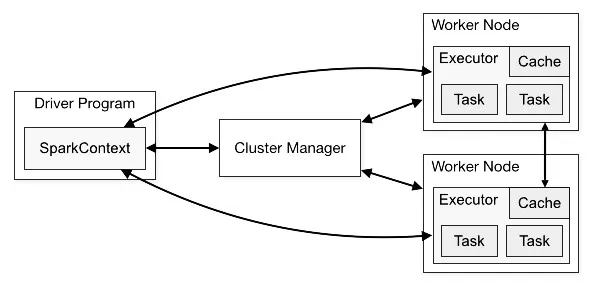

# Apache Spark

## o que é o spark?

é uma tecnologia voltada para o bigdata, ou seja capaz de analisar um grande volume de dados.

- spark é distruibuido em maquinas (clusters)
- seus dados são armazenadas em memoria ram ( o que o torna mais rapido)
- pode ser processado em real time (straming) em lotes (batchs), sql e até machine learning
- suporta diversas linguagens (sql, python, skala, java)
- tem integração com diversos bancos de dados e plataforma


> **engine em memoria**: busca o dado e salva em memoria Ram, ao inves de disco, por isso eh mais rapido que Hadoop Reduce

## Arquitetura Spark




- **Driver Program**: entry point do Spark. É onde o Spark Context é criado e onde se define o fluxo de execução, bem como o RDD e o que deve ser executado em paralelo pelos Executores.
- **Spark Context**: Estabelece configurações de memória e processamento dos Workers Nodes (máquinas). Conecta com diferentes tipos de Cluster Manager (Spark, Apache Mesos, Yarn do Hadoop, Kubernetes).
- **Workers / Executores**: máquinas que recebem as tarefas e processam as partições em paralelo.
- **Partições**: divisões dos dados distribuídas entre os nós do cluster.


## RDD (resilient distributed dataset)

RDD é a API que interage com as partições e processa transformações:

- **Resilient** — caso exista algum erro/falha na comunicação dos drives e nodes, ele vai recalcular sem perder o processo
- **Distributed** — distribuído em partições e memória
- **Dataset** — conjunto não tipado de dados


## Interfaces do Spark

| Interface  | Nível      | Tipagem       | Linguagens              |
|------------|------------|---------------|-------------------------|
| RDD        | Baixo nível | Não tipado    | Todas                   |
| DataFrame  | Alto nível | Não tipado    | Python, Java, R, Scala  |
| Dataset    | Alto nível | Fortemente tipado | Java, Scala         |

- **RDD**: API fundamental. Mais flexível, porém mais complexo de usar.
- **DataFrame**: Similar ao pandas, distribuído e com otimizações automáticas. O mais usado no dia a dia.
- **Dataset**: Combina a praticidade do DataFrame com a segurança de tipos do RDD.

## Configuração

### SparkSession

o spark session é o ponto de entrada do spark, onde podemos criar dataframes, consultar dados sql, criar tabelas e outras funções mais.

```{python}

from pyspark.sql import SparkSession

spark = SparkSession.builder \
    .master('local[*]) \
    .appName("Iniciando com spark")
    .getOrCreate()


```


## Leitura de Dados

### CSV

```python
# Forma simples
path = 'caminho/arquivo.csv'
dados_csv = spark.read.csv(path, header=True, inferSchema=True, sep=';')
```

```python
# Forma encadeada (mais legível)
customer_df = spark.read.format("csv") \
    .option("header", "true") \
    .option("inferSchema", "true") \
    .option("sep", ";") \
    .load(path)
```

**Parâmetros principais:**
- `path` — onde está localizado o arquivo
- `header=True` — indica que o df deve ter cabeçalho
- `inferSchema=True` — Spark identifica automaticamente os tipos de cada coluna
- `sep` — especificação do separador (`,` ou `;`)


#### Schemas
Usar `inferSchema` pode causar atribuições de tipos erradas e deixar a leitura mais lenta. Por isso, é recomendado definir o schema manualmente.

**StructType (Python):**
```python
from pyspark.sql.types import *

customer_schema = StructType([
    StructField("customer_id", IntegerType(), False),
    StructField("tax_id", StringType(), True),
])

df = spark.read.format("csv") \
    .schema(customer_schema) \
    .option("header", "true") \
    .load(path)
```

**DDL Schema:**
```python
ddl_schema = "customer_id INT NOT NULL, tax_id STRING"

df = spark.read.format("csv") \
    .schema(ddl_schema) \
    .option("header", "true") \
    .load(path)
```


### JSON

```python
df_json = spark.read.format("json") \
    .option("multiLine", "true") \
    .load(path)
```

> JSON é uma coleção de objetos com pares chave:valor, muito usado em APIs.


### Parquet

```python
# [ ] estudar leitura de Parquet
df_parquet = spark.read.parquet(path)
```

---


## Visualização de Dados

```python
df.show()          # exibe as primeiras 20 linhas no terminal
df.display()       # exibe de forma mais rica (Databricks)
df.limit(5).show() # mostra os 5 primeiros registros
df.printSchema()   # mostra os metadados do df (tipos de cada coluna)
df.count()         # conta o número de linhas
df.columns         # lista os nomes das colunas
df.dtypes          # lista colunas e seus tipos
```


## Transformações

### Transformations vs Actions

O Spark usa **lazy evaluation**: ele não executa nada até que uma Action seja chamada.

- **Transformations** — definem o que fazer, mas não executam. Retornam um novo DataFrame(Nao altera o original).
  - ex: `select`, `filter`, `withColumn`, `groupBy`, `join`

- **Actions** — disparam a execução de tudo que foi definido antes. Retornam um resultado.
  - ex: `show()`, `count()`, `collect()`, `write`

### Renomeando Colunas

```python
# [ ] estudar withColumnRenamed
# [ ] estudar alias
# [ ] estudar toDF para renomear múltiplas colunas de uma vez
```

### Seleção e Filtro

```python
# [ ] estudar select
# [ ] estudar filter / where
# [ ] estudar distinct
# [ ] estudar orderBy / sort
```

### Criando e Modificando Colunas

```python
# [ ] estudar withColumn
# [ ] estudar cast (conversão de tipos)
# [ ] estudar lit (valores literais)
# [ ] estudar funções da pyspark.sql.functions (F.col, F.when, F.concat, etc.)
```

### Agrupamento e Agregação

```python
# [ ] estudar groupBy
# [ ] estudar agg (count, sum, avg, min, max)
# [ ] estudar pivot
```

### Joins

```python
# [ ] estudar inner join
# [ ] estudar left join
# [ ] estudar full outer join
# [ ] diferença entre join no DataFrame vs SQL
```

## Data Cleaning

### Tratamento de Nulos

```python
# [ ] isNull() / isNotNull() — verificar existência de nulos
# [ ] dropna()  — remover linhas com nulos
#     df.dropna()                     → remove qualquer linha com null
#     df.dropna(subset=["coluna"])    → remove nulos apenas em colunas específicas
#     df.dropna(thresh=2)             → mantém linhas com ao menos N valores não-nulos

# [ ] fillna() — substituir nulos por um valor padrão
#     df.fillna(0)                          → preenche todos os nulos com 0
#     df.fillna({"idade": 0, "nome": "N/A"}) → preenche por coluna

# [ ] F.coalesce() — retorna o primeiro valor não-nulo entre colunas
# [ ] F.when().otherwise() — lógica condicional para tratar nulos
```

### Tipos de Dados

```python
# [ ] cast() — converter tipo de uma coluna (ex: string → int)
# [ ] printSchema() — inspecionar tipos antes de limpar
# [ ] to_date() / to_timestamp() — converter strings para datas
# [ ] F.regexp_replace() — limpar strings com regex (ex: remover R$, %, etc.)
```

### Deduplicação

```python
# [ ] dropDuplicates() — remover linhas duplicadas
# [ ] dropDuplicates(subset=["col"]) — deduplicar com base em colunas específicas
# [ ] distinct() — todas as linhas únicas
```

### Padronização de Strings

```python
# [ ] F.trim() / F.ltrim() / F.rtrim() — remover espaços
# [ ] F.lower() / F.upper() — padronizar case
# [ ] F.regexp_replace() — substituições com regex
# [ ] F.split() — separar string em array
```

## SQL com Spark

```python
# [ ] createOrReplaceTempView — registrar df como tabela temporária
# [ ] spark.sql("SELECT ...") — executar queries SQL diretamente
# [ ] diferença entre Temp View e Global Temp View
```